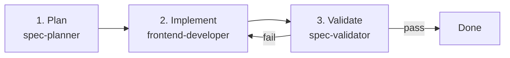
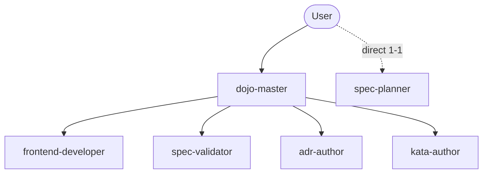
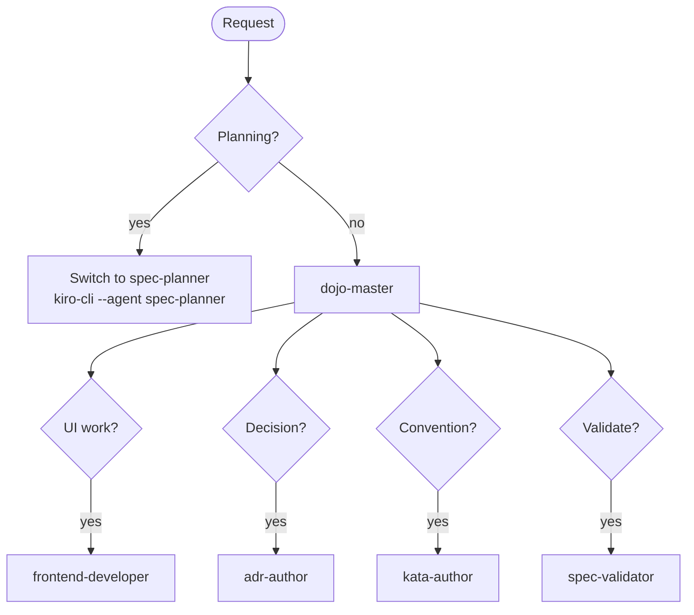

# Agent Workflow

## Feature Development

## Agent Responsibilities

## Routing

## Agents

| Agent | Writes to |
|-------|----------|
| spec-planner | specs/NNNN/ |
| frontend-developer | cmd/, templates, CSS |
| spec-validator | specs/NNNN/validation-report.md |
| adr-author | docs/adr/ |
| kata-author | skills/, rules/, .agents/ |
| dojo-master | nothing (coordinates only) |
