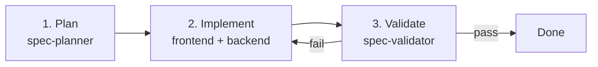
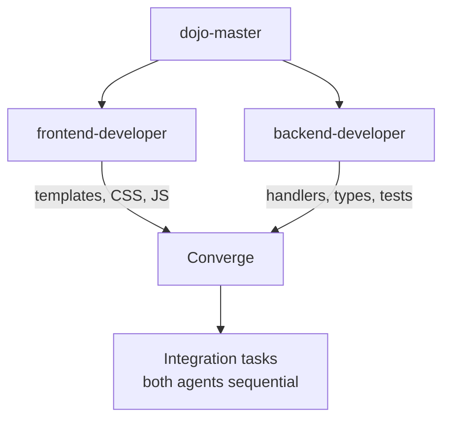
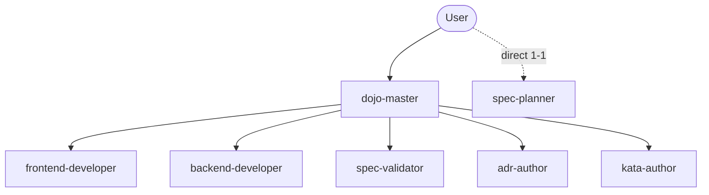
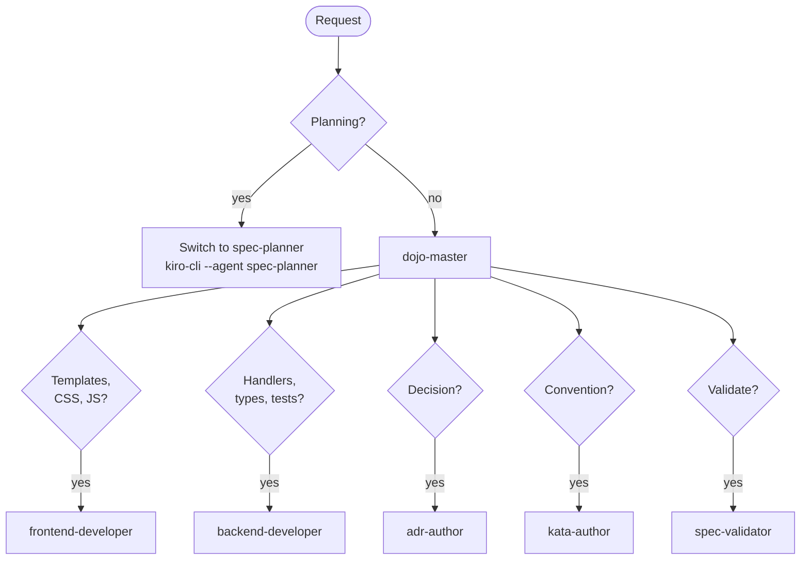

# Agent Workflow

## Feature Development



## Parallel Implementation



## Task Parallelization Example

```text
Time ──────────────────────────────────────────────►

frontend-developer │ Nav ─── JS ─── Components ──┐
                   │                              ├─► Rules listing ─► Detail ─► Tests
backend-developer  │ Handlers ─── Types ─────────┘
```

## Agent Responsibilities



## Routing



## Agents

| Agent | Scope | Writes to |
|-------|-------|----------|
| spec-planner | Feature planning | specs/NNNN/ |
| frontend-developer | Templates, CSS, JS | web/, templates/ |
| backend-developer | Go handlers, types, tests | cmd/, handlers, types |
| spec-validator | Acceptance review | specs/NNNN/validation-report.md |
| adr-author | Architecture decisions | docs/adr/ |
| kata-author | Skills, rules, profiles | skills/, rules/, .agents/ |
| dojo-master | Coordination | nothing (delegates only) |
